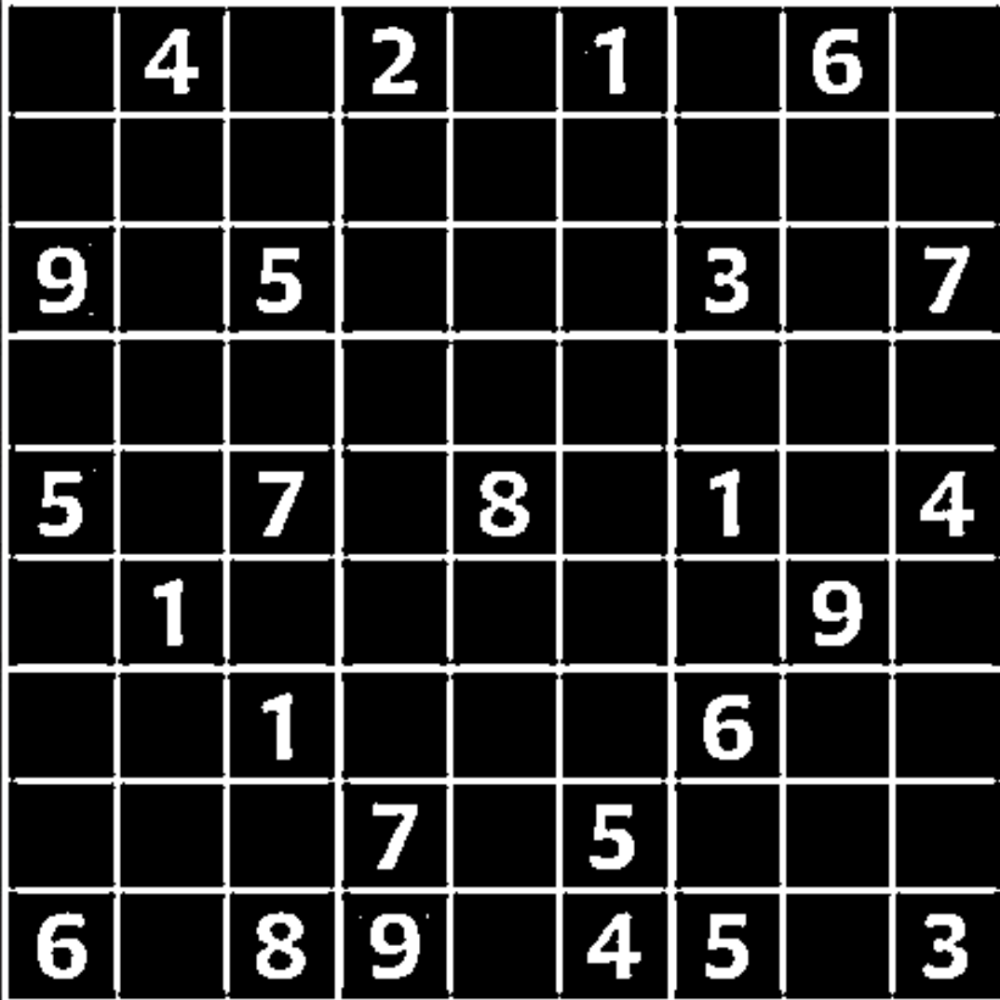
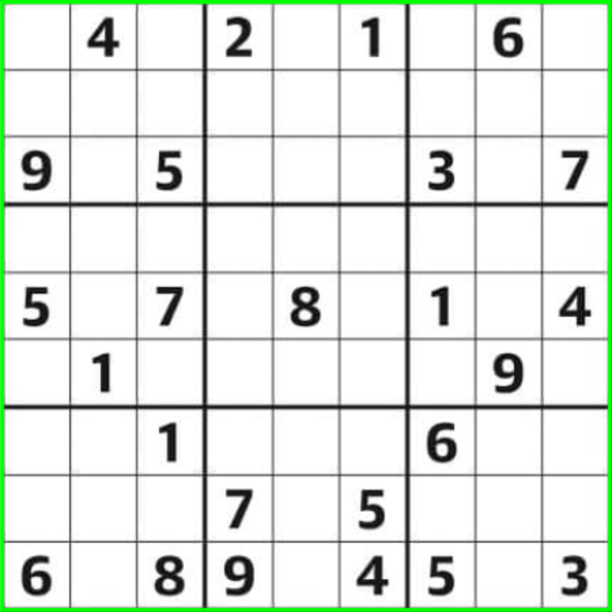
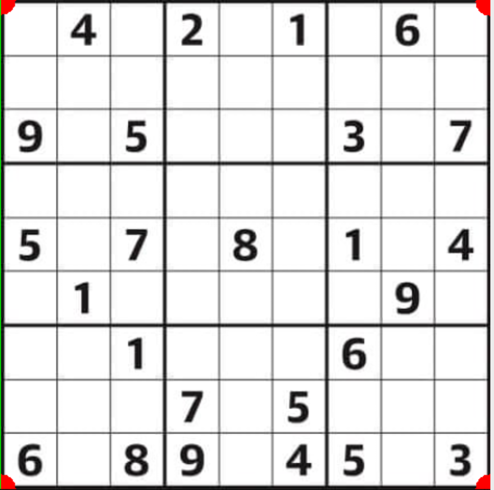
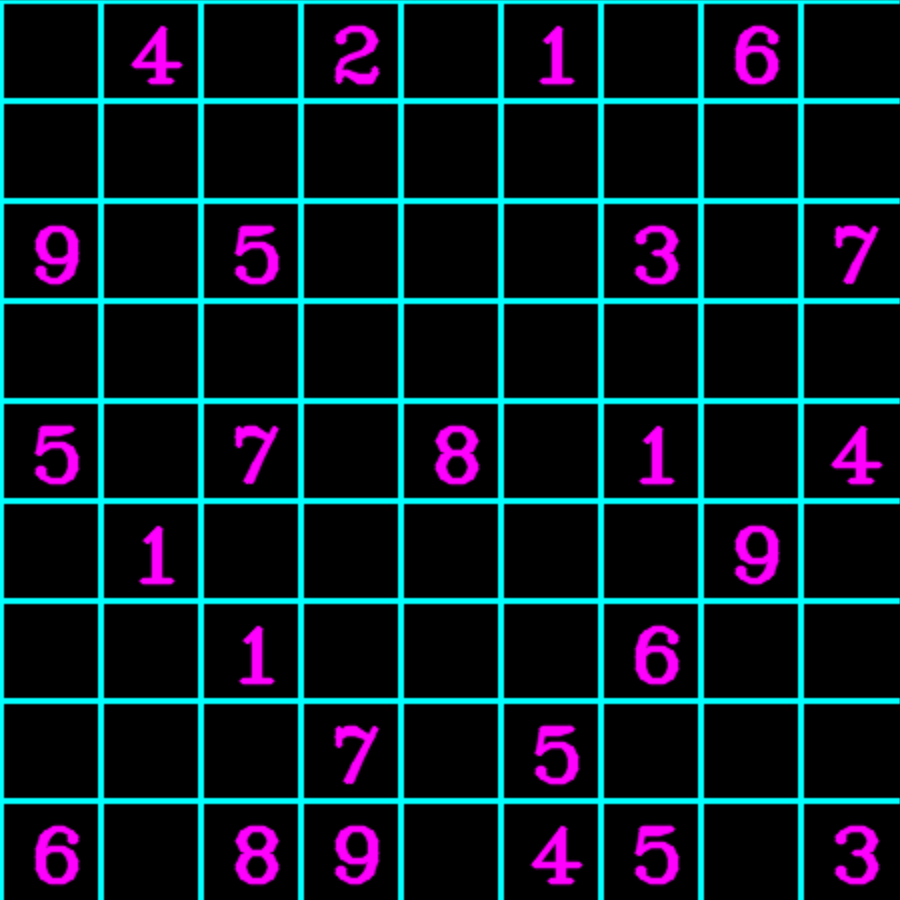
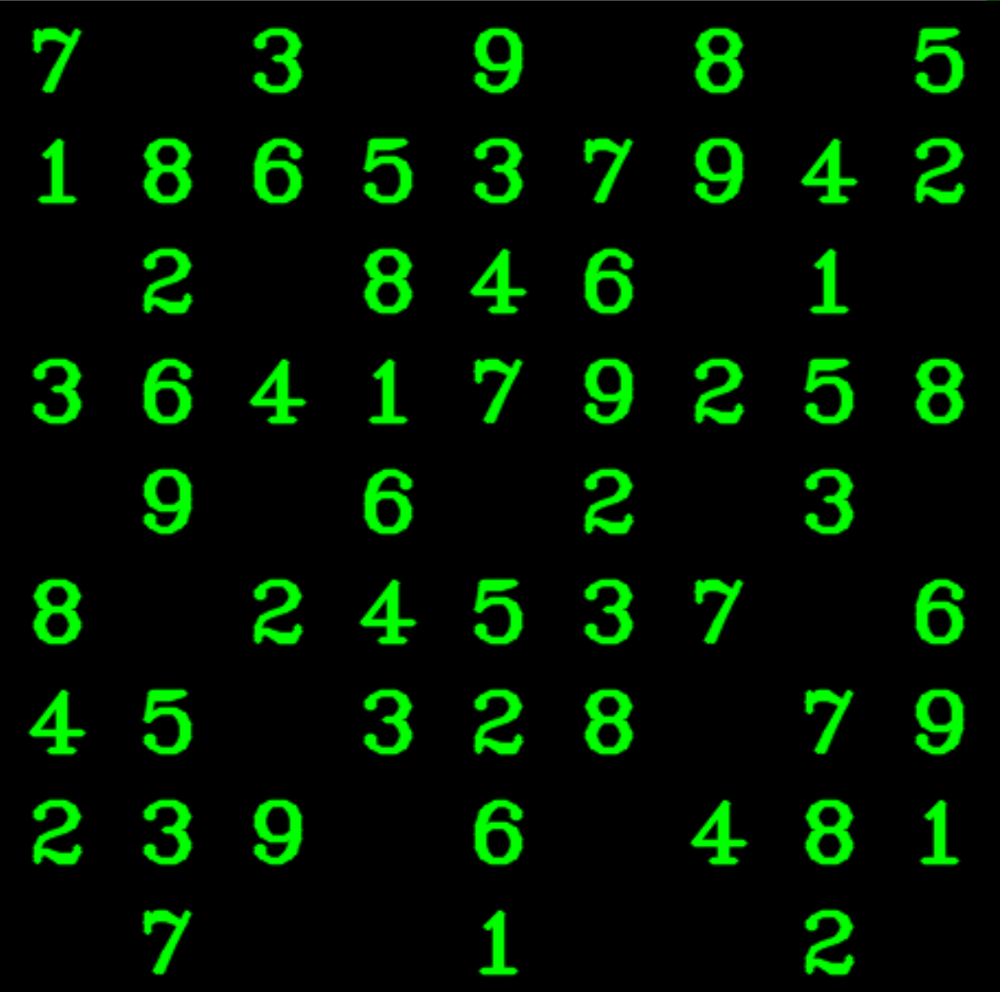
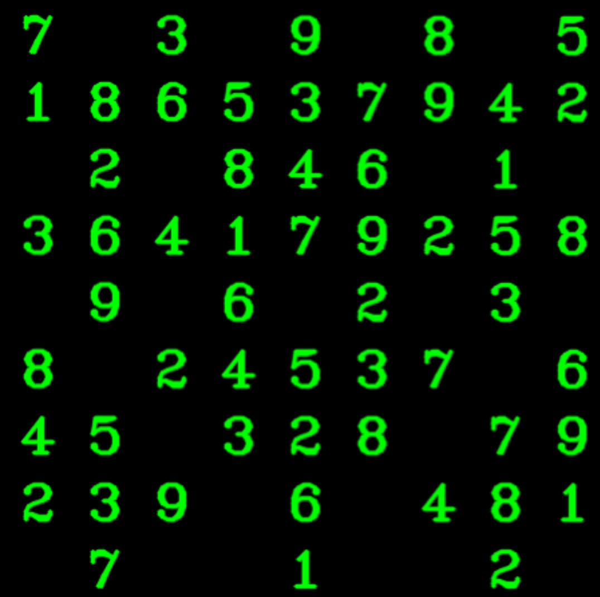
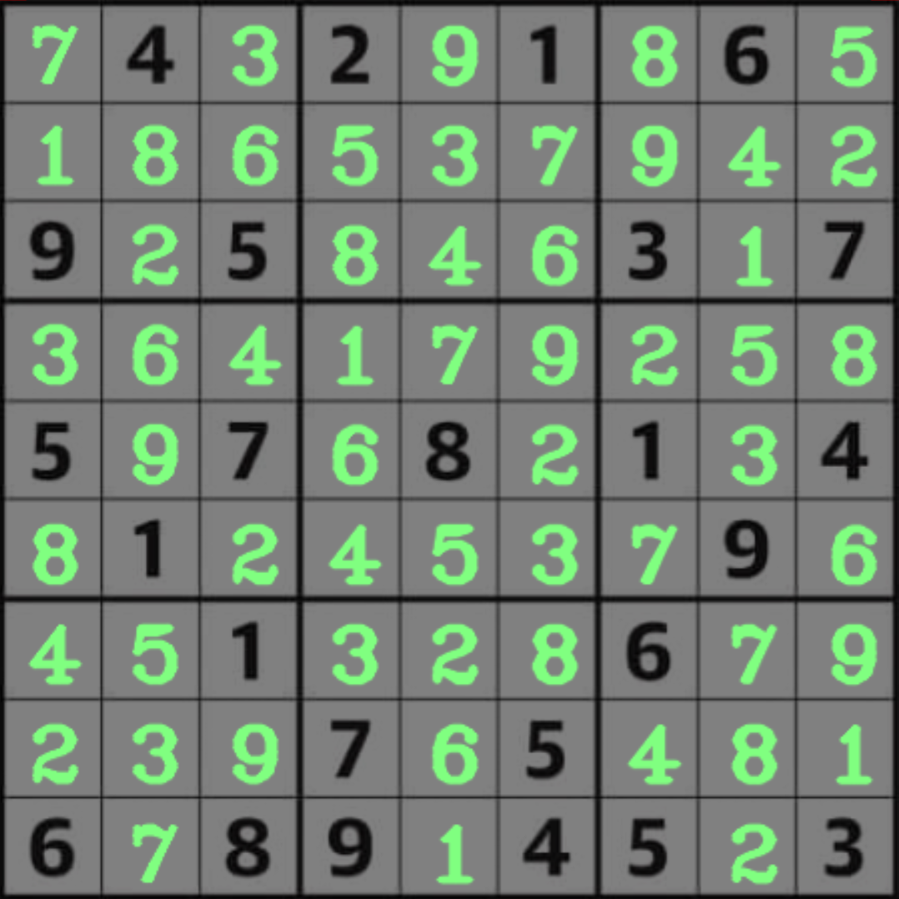

# OCR Sudoku Solver 
OCR Sudoku Solver is a Python application that solves sudoku boards from photos. 

## Features 
- [x] Extracts detected to digits from Photos.
- [x] Utilizes a Machine Learning model trained on 10,000+ pictures to detect digits. 
- [x] Solves Sudoku Puzzle by using the backtracking algorithm.
- [x] Overlays solved solution on the original photo. 

## Video Walkthrough 
Here's a how it was implemeted:
1. Apply Grey scale + Gaussian blur to the orginal image 

2. Get the borders/contours

3. Get corner points 

4. Prep image for splitting and detection

5. Solve Sudoku + display numbers 

6. Adjust the solved board to fit original image 

7. Overlay solution on original image

Full walkthrough:

##  Notes
- To run this application, download all the files, make sure you have installed  Python3,numpy(1.20.2), OpenCV(4.5.1.48), Tensorflow(2.3.1), and Keras(2.3.1), and run Sudokuapp.py.

- To train the model yourself, you can run ocr_cnn_trainer.py after using Tensorflow and keras (2.3.1) and downloading the dataset [here](http://www.ee.surrey.ac.uk/CVSSP/demos/chars74k/). 

## Open-source libraries used 
- [OpenCV](https://pypi.org/project/opencv-python/) - 4.5.1
- [Keras](https://pypi.org/project/keras/)- 2.3.1
- [TensorFlow](https://www.tensorflow.org/install) - 2.3.1 
- [scikit-learn](https://scikit-learn.org/stable/install.html) - 0.24.1
- [pickle](https://docs.python.org/3/library/pickle.html)

## Acknowledgments 
- [Open CV tutorial for beginners](https://www.youtube.com/watch?v=kdLM6AOd2vc&list=PLS1QulWo1RIa7D1O6skqDQ-JZ1GGHKK-K)
- [Sudoku board extraction](https://maker.pro/raspberry-pi/tutorial/grid-detection-with-opencv-on-raspberry-pi)
- [Deep learning basics](https://www.youtube.com/watch?v=Mubj_fqiAv8&list=PLeo1K3hjS3uu7CxAacxVndI4bE_o3BDtO)

- [Long OpenCV tutorial](https://www.youtube.com/watch?v=WQeoO7MI0Bs)
